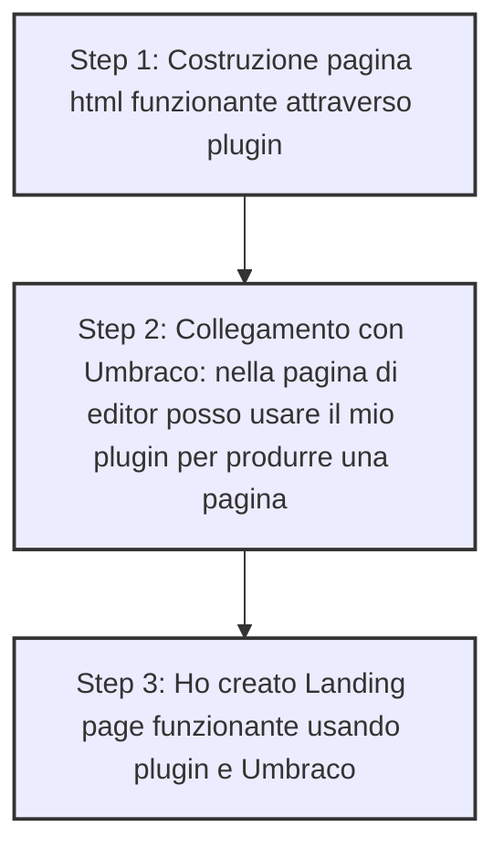

# Project: Web-Based Editor

This project aims to create an editor similar to [Puck Editor](https://demo.puckeditor.com/edit). Below is a list of completed and pending tasks, as well as the project's final goal.

---

## Completed Tasks ✅
1. **Create a grid**  
   - Implemented the ability to create multiple grids.
   
2. **Create widgets**  
   - Added widgets within the grids.

3. **Make grids interchangeable**  
   - Enabled drag-and-drop functionality to reorder grids.

4. **Create a sidebar**  
   - Designed and implemented a sidebar for editing widget properties.

5. **Modify widgets through the sidebar**  
   - Widgets can now be styled and updated with custom HTML and CSS via the sidebar.

---

## Pending Tasks 🛠️
1. **Add `.gitignore` and clean up the repository**  
   - Remove unnecessary files and ignore node modules and build artifacts.

2. **Enable widget drag-and-drop**  
   - Allow widgets to be reordered within and between grids.

3. **Improve sidebar functionality**  
   - Ensure the sidebar fully reads and populates inputs based on the selected widget's data.

4. **Continue the list of todos**  
   - Identify and implement additional features necessary to achieve the final goal.

---

## Final Goal 🎯
Create a web-based editor with functionality similar to [Puck Editor](https://demo.puckeditor.com/edit), including:
- **Drag-and-drop interface** for grids and widgets.
- **Dynamic editing tools** in the sidebar for real-time customization.
- **Full compatibility** with customizable layouts and reusable components.

---

## Project Workflow Diagram

